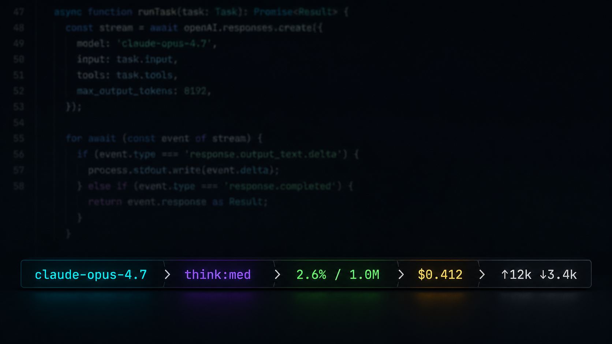
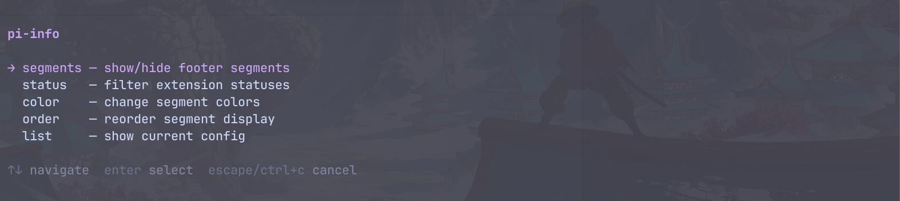
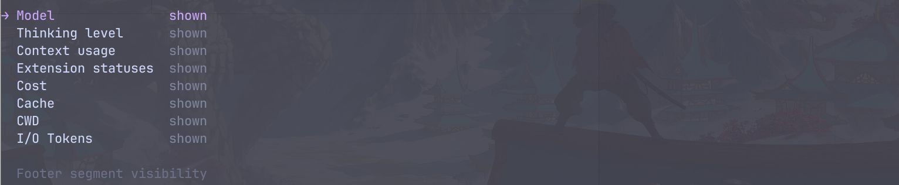
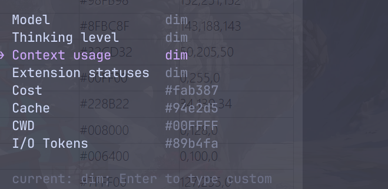

# pi-info

[English](README.md) | [简体中文](README.zh-CN.md)

<p align="center"></p>

[pi](https://pi.dev) 的完全可定制状态栏。starship 风格的格式模板、可插拔 segment、优先级排序、逐段配色、shell 命令 segment，外加开放注册 API——任何扩展都能注册自己的组件。内置模型、思考等级、上下文压力、花费、扩展状态等开箱即用的 segment。

```text
claude-opus-4.7  ❯  think:med  ❯  2.6% / 1.0M  ❯  $0.412  ❯  ↑12k ↓3.4k  ❯  ~/projects/app
```

## 特性

- **模型可见** —— 不再因为手滑把贵的模型用在小事上，当前模型始终在眼前。
- **思考等级** —— 推理档位设错时立刻发现。
- **上下文压力** —— 用量随接近窗口上限由绿转黄再转红。
- **花费追踪** —— 可选的成本、缓存命中、token 输入输出段。
- **格式模板** —— 用 starship 风格模板重塑任意段：`{var}` 插值、`[text](style)` 局部样式、可选组。Nerd Font 图标和 emoji 直接往里贴。
- **Shell 命令 segment** —— 一条配置就把任意命令的 stdout 变成一个段。
- **可插拔 segment** —— 任何扩展一个函数调用即可注册自己的段；pi-info 保持纯展示层。
- **完全可配置** —— 在 pi 内开关、改色、排序、改格式，设置跨会话持久化。

<p align="center"></p>

## 快速开始

```bash
pi install npm:@sentixx/pi-info
```

pi 已在运行？先 `/reload`，再打开配置器：

```text
/info
```

## Segment 一览

| Segment | 显示内容 | 变量 | 默认格式 |
| --- | --- | --- | --- |
| `model` | 当前模型名 | `{name}` `{id}` | `{name}` |
| `thinking` | 思考等级，按等级着色 | `{level}` | `think:{level}` |
| `context` | 上下文用量，绿 → 黄 → 红 | `{percent}` `{window}` | `{percent}% / {window}` |
| `extensions` | 其他扩展设置的状态徽章 | `{key}` `{text}` | `{key}:{text}` |
| `billing` | 会话累计花费 | `{cost}` | `${cost}` |
| `cache` | 提示缓存命中率 | `{percent}` | `{percent}%` |
| `io` | 累计 token 输入输出 | `{input}` `{output}` `{total}` | `(↑{input}  )(↓{output})` |
| `cwd` | 工作目录 | `{dir}` | `{dir}` |
| `branch` | 当前 git 分支 | `{branch}` | `{branch}` |

没有内容可显示的段会自动隐藏。

## 配置

<p align="center"></p>

### `/info` 命令

| 子命令 | 作用 |
| --- | --- |
| `/info segments` | 开关任意段，含扩展状态 |
| `/info color` | 每段颜色——主题色名或 `#RRGGBB` |
| `/info order` | 调整段顺序 |
| `/info separator` | 自定义段之间的分隔符（字符 + 颜色） |
| `/info format` | 编辑每段的格式模板 |
| `/info preset` | 一键套用格式预设（`plain` / `nerd` / `emoji`） |

**段可见性：**

<p align="center"></p>

**颜色配置：**

<p align="center"></p>

### 配置文件

设置持久化到 `~/.pi/agent/pi-info.json`——每个 segment 一个配置对象：

```json
{
  "separator": { "char": "❯", "color": "dim" },
  "segments": {
    "model":   { "format": " {name}", "color": "accent", "order": 1 },
    "context": { "format": "[{percent}%](auto bold) · {window}" },
    "io":      false,
    "weather": { "command": "curl -s 'wttr.in?format=%t'", "interval": 300 }
  }
}
```

每段可用的键（全部可选）：

| 键 | 含义 |
| --- | --- |
| `format` | 模板字符串；省略则用该段默认格式 |
| `color` | 未套样式文本的基础色——主题色名或 `#RRGGBB` |
| `order` | 优先级，越小越靠前（默认 999） |
| `hidden` | 隐藏该段；`"name": false` 是简写 |
| `command` | shell 命令，stdout 即 `{output}` —— 定义一个自定义段 |
| `interval` | 命令输出缓存 N 秒（默认 60） |
| `label` | 命令段在 `/info` 里的显示名 |

### 格式模板

```text
{var}            变量插值
[text](style)    局部样式——颜色（#RRGGBB / 主题色名）、"auto"、
                 以及 bold / italic / underline，空格分隔
(group)          可选组：组内所有 {var} 都为空时整组消失
\x               转义任意语法字符
```

`auto` 解析为该段的语义色——自定义格式后 context 仍保留阈值变色、
thinking 仍保留等级色。任何 Unicode 都能用：Nerd Font 字形、emoji、powerline 字符。

```json
"context": "[{percent}%](auto) [of](dim) {window}",
"branch":  "[](#f34f29) {branch}",
"io":      "(⬆{input}  )(⬇{output})"
```

### 环境变量

| 变量 | 用途 | 示例 |
| --- | --- | --- |
| `PI_INFO_SHOW` | 启动默认显示的段 | `model,context` |
| `PI_INFO_THRESHOLDS` | 上下文警告,危险百分比 | `70,90` |
| `PI_INFO_CONFIG` | 覆盖配置文件路径 | `/tmp/sl.json` |

## 扩展：自定义 segment

任何东西都可以成为一个 segment。零代码路径是配置里的 `command` 条目（见上）。需要完全控制时，在任何 pi 扩展或脚本里注册：

```ts
import { registerSegment } from "@sentixx/pi-info/extensions/statusline.js";

registerSegment({
	name: "review-queue",
	label: "Review Queue",
	// 暴露模板变量，用户就能自己改你这个段的格式：
	data(ctx) {
		const count = getQueueCountSomehow();
		return count > 0 ? { count: String(count) } : null; // null 即隐藏
	},
	defaultFormat: "{count} reviews",
	color: () => "#89b4fa",
});
```

只实现 `render()` 的段也能工作——其输出以 `{output}` 变量暴露给模板。注册的段自动出现在 `/info segments`、`color`、`order`、`format` 中，设置持久保存。扩展也可以通过 pi 的 `ctx.ui.setStatus()` 发布轻量的一次性徽章，显示在 `extensions` 段里。

## 架构

```text
extensions/statusline.ts   入口：事件接线、/info 命令、footer 安装
lib/
  constants.ts             段名、标签、默认值
  config.ts                每段配置持久化 + 环境变量解析
  template.ts              格式模板引擎（{var}、[..](style)、可选组）
  colors.ts / text.ts      颜色与文本工具
  presets.ts               一键格式预设
  registry.ts              动态段注册表（registerSegment 公开 API）
  footer.ts                footer 单行渲染器
  status-filter.ts         扩展状态过滤
  configurators/           /info TUI 配置器
segments/                  SegmentProvider 接口 + 内置 provider
```

## 路线图

- **自定义渲染器** —— 配置指向你自己的 TS 模块，完全接管 footer 渲染，类似 Claude Code 的 statusline。

## 致谢与许可

MIT。源自对 Jenny Yu 的 [pi-bar](https://github.com/tianrendong/pi-bar)（MIT）的重写；见 [LICENSE](LICENSE)。
